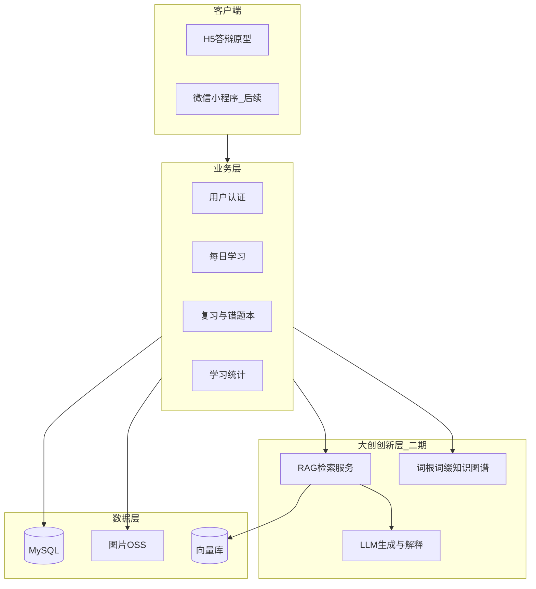
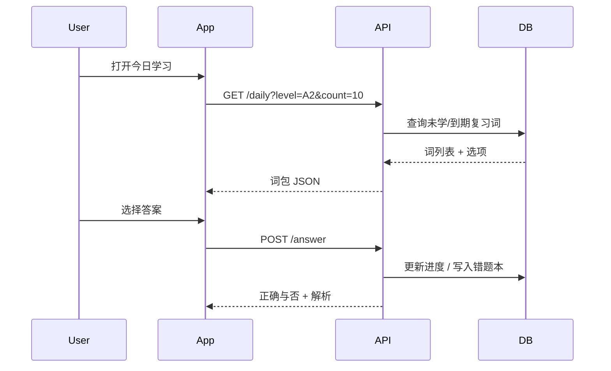
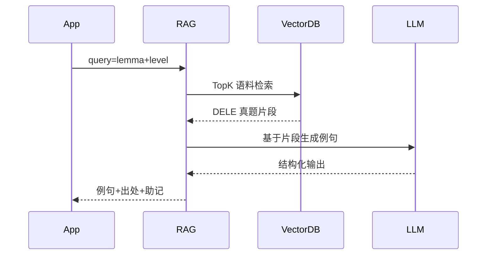

# 系统架构设计

## 1. 总体架构

## 2. 技术选型

| 层级 | 方案 | 说明 |
|------|------|------|
| 前端 | uni-app (Vue3) | 一套代码编译 H5 + 微信小程序 |
| 后端 | 微信云开发 / Node.js | 答辩阶段本地 mock；上线后云函数或 Express |
| 数据库 | MySQL 8 | 词库、用户进度、错题本 |
| 缓存 | Redis（可选） | 会话、热点词包 |
| 对象存储 | COS/OSS | 5000+ 配图 CDN |
| 向量检索 | pgvector / Milvus | RAG 语料检索（三期） |
| Embedding | BGE-M3 / multilingual-e5 | 西语语义向量 |
| LLM | DeepSeek / 通义等 API | 例句讲解、错题解析 |

## 3. 核心业务流程

### 3.1 每日学习

### 3.2 SM-2 复习算法（二期）

- 答对：增大 `ease_factor`，延长 `interval_days`
- 答错：重置间隔，写入 `mistake_book`，`wrong_count++`
- `next_review = today + interval_days`

### 3.3 RAG 例句生成（三期）

## 4. API 设计（草案）

| 方法 | 路径 | 说明 |
|------|------|------|
| GET | `/api/words/daily` | 获取今日词包 |
| POST | `/api/words/answer` | 提交答案 |
| GET | `/api/mistakes` | 错题本列表 |
| GET | `/api/stats` | 学习统计 |
| POST | `/api/auth/login` | 微信登录（二期） |

## 5. 部署架构

### 答辩阶段

- 前端：H5 静态页，`npm run dev:h5` 本地演示
- 数据：`frontend/static/words.json` 本地 mock

### 上线阶段

- 前端：微信小程序 + 云存储静态资源
- 后端：腾讯云/阿里云轻量服务器 或 微信云开发
- 数据库：云 MySQL + 自动备份
- CDN：配图与音频加速

## 6. 安全设计

- 全链路 HTTPS
- 微信 OAuth，不存储明文密码
- 最小化采集：openid、昵称、学习记录
- SQL 参数化，防注入
- 图片与词库版权台账

## 7. 扩展性

- 词库通过 CSV + `import_words.py` 批量导入
- `tags` JSON 字段支持专题包（旅游、商务等）
- `corpus_chunks` 表预留 RAG 语料
- 前端页面与后端 API 解耦，便于 H5 → 小程序迁移
