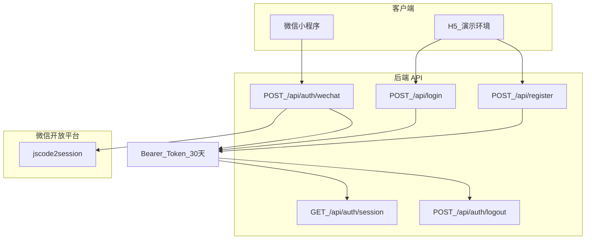

# 用户登录体系说明

> 适用：H5 答辩演示 + 微信小程序生产环境  
> 相关：[微信小程序注册审批全流程](wechat-registration-approval-flow.md) · [API 文档](api.md)

---

## 一、双通道登录架构



| 环境 | 登录方式 | openid 规则 | 生产环境 |
|------|----------|-------------|----------|
| **H5 演示** | 昵称注册 + 登录 | `demo_{昵称}` | 默认关闭（`ALLOW_DEMO_LOGIN=false`） |
| **微信小程序** | `uni.login` → code → 后端换 openid | 微信真实 openid | **唯一推荐方式** |

---

## 二、会话机制

| 项 | 说明 |
|----|------|
| Token 存储 | 前端 `uni.storage` 键 `auth_token` |
| 传输方式 | `Authorization: Bearer <token>` |
| 有效期 | **30 天**（`SESSION_TTL_DAYS`，见 `backend/src/middleware/auth.js`） |
| 过期处理 | 返回 `401` / `TOKEN_EXPIRED`，前端跳转登录页 |
| 登出 | `POST /api/auth/logout` 服务端作废 token + 前端清缓存 |
| 续期 | 每次登录/微信登录重新签发 30 天 token |

**安全说明**：AppSecret 仅存 `backend/.env`，绝不写入小程序前端。

---

## 三、微信小程序登录流程

```
1. 用户打开小程序 → 隐私同意页（consent.vue）
2. 未登录 → 跳转 login.vue
3. 点击「微信一键登录」
4. uni.login() 获取临时 code（5 分钟有效，仅用一次）
5. POST /api/auth/wechat { code }
6. 后端调微信 jscode2session → openid (+ unionid)
7. 按 openid 查找/创建用户 → 返回 token + user 状态
8. 若 needsProfile=true → 完善头像昵称（WechatProfileForm）
9. 进入首页 Tab
```

### 首次资料完善

微信 2022 年后不再默认可用 `getUserProfile`，本项目采用：

- `open-type="chooseAvatar"` 选头像
- `type="nickname"` 输入昵称
- 上传 `POST /api/user/avatar` 或 `PATCH /api/me/profile`

`needsProfile` 条件：微信用户且昵称为空或「微信用户」。

---

## 四、H5 演示登录流程

```
1. 隐私同意 → login.vue
2. 输入昵称 →「注册新账号」POST /api/register
3. 或「登录」POST /api/login（须已注册）
4. token 写入本地 → 进入首页
```

生产环境 `NODE_ENV=production` 且未设 `ALLOW_DEMO_LOGIN=true` 时，演示注册/登录返回 `403 DEMO_LOGIN_DISABLED`。

---

## 五、API 一览

| 方法 | 路径 | 认证 | 说明 |
|------|------|:----:|------|
| POST | `/api/register` | 否 | H5 演示注册 |
| POST | `/api/login` | 否 | H5 演示登录 |
| POST | `/api/auth/wechat` | 否 | 小程序 code 登录 |
| GET | `/api/auth/session` | 是 | 校验 token 是否有效 |
| POST | `/api/auth/logout` | 是 | 登出作废 token |
| GET | `/api/me` | 是 | 完整用户学习状态 |
| PATCH | `/api/me/profile` | 是 | 更新昵称 |
| POST | `/api/user/avatar` | 是 | 上传头像 |

### 登录响应示例

```json
{
  "token": "a1b2c3...",
  "authType": "wechat",
  "sessionExpiresAt": "2026-08-11T12:00:00.000Z",
  "lastLoginAt": "2026-07-12T12:00:00.000Z",
  "user": {
    "userId": 1,
    "nickname": "Maria",
    "authType": "wechat",
    "isWechatUser": true,
    "needsProfile": false,
    "targetLevel": "A2",
    "learnedIds": [],
    "todaySession": { "finished": false }
  }
}
```

---

## 六、前端鉴权守卫

| 位置 | 行为 |
|------|------|
| `App.vue` `onLaunch` / `onShow` | 未同意隐私 → consent；无 token → login |
| `userService.requireAuth()` | Tab 页 onShow 拉取 `/api/me`，失败跳转登录 |
| `api.js` 401 拦截 | 清 token；`TOKEN_EXPIRED` 提示后跳转 |
| `stats.vue` | 退出登录调用服务端 logout |

---

## 七、环境配置清单

### 后端 `backend/.env`

```env
WECHAT_APPID=wxXXXXXXXXXXXXXXXX
WECHAT_APPSECRET=xxxxxxxxxxxxxxxxxxxxxxxxxxxxxxxx
NODE_ENV=production
ALLOW_DEMO_LOGIN=false
```

### 前端 `frontend/src/manifest.json`

```json
"mp-weixin": {
  "appid": "wxXXXXXXXXXXXXXXXX",
  "__usePrivacyCheck__": true
}
```

### 前端 `frontend/src/config/app.js`

填写 `orgName`、`contactEmail`、`advisorName`（隐私政策展示）。

### 微信公众平台

- 开发设置 → AppID / AppSecret
- 服务器域名 → request 合法域名（HTTPS API）
- 用户隐私保护指引 → 声明 openid、昵称、头像、学习记录

---

## 八、常见问题

| 问题 | 原因 | 处理 |
|------|------|------|
| `WECHAT_NOT_CONFIGURED` | 后端未填 AppID/Secret | 配置 `backend/.env` |
| `code been used` | code 重复使用 | 每次登录重新 `uni.login` |
| `invalid code` | code 过期（>5min） | 重新获取 code |
| 真机 request 失败 | 域名未加白名单 | 公众平台添加合法域名 |
| H5 生产无法登录 | 演示登录已关闭 | 改用小程序或临时开 `ALLOW_DEMO_LOGIN` |
| 登录后立刻掉线 | token 过期 | 重新微信登录 |

---

## 九、代码索引

| 模块 | 路径 |
|------|------|
| 会话与登出 | `backend/src/middleware/auth.js` |
| 微信 code2session | `backend/src/services/wechat.js` |
| 路由 | `backend/src/index.js` |
| 小程序 uni.login | `frontend/src/utils/wechatAuth.js` |
| 登录页 | `frontend/src/pages/auth/login.vue` |
| 资料完善 | `frontend/src/components/WechatProfileForm.vue` |
| Token 存储 | `frontend/src/utils/api.js` |
