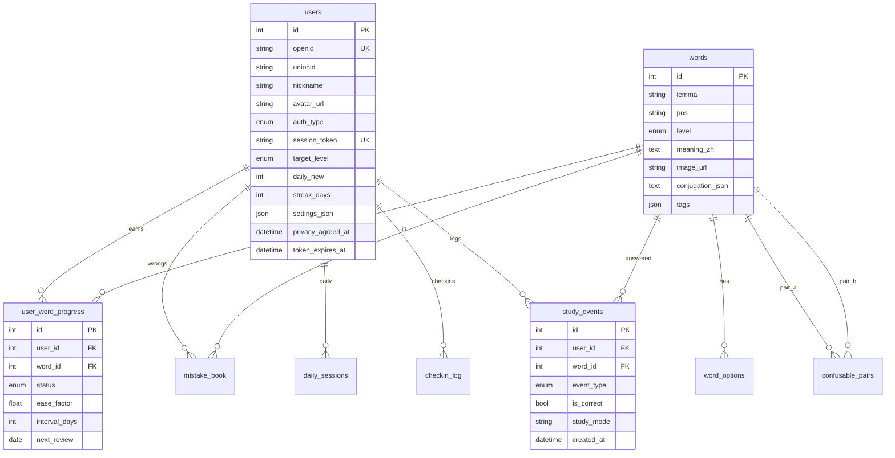

# 数据库设计说明（个人开发者版）

> 存储引擎：开发 SQLite（`backend/data/xiyu.db`）· 生产可迁 MySQL（`docs/schema.sql`）  
> 设计目标：支撑 **个人微信小程序** 登录、学习进度、SM-2 复习、行为分析与大创数据导出

---

## 一、ER 关系总览



---

## 二、表清单

| 表 | 用途 | 个人主体是否必需 |
|----|------|:----------------:|
| `users` | 微信 openid / 演示账号、会话、偏好设置 | ✅ |
| `words` | DELE 分级词库 | ✅ |
| `word_options` | 四选一干扰项 | ✅ |
| `user_word_progress` | SM-2 学习进度 | ✅ |
| `mistake_book` | 错题本 | ✅ |
| `daily_sessions` | 每日学习配额统计 | ✅ |
| `checkin_log` | 打卡热力图 | ✅ |
| `study_events` | **答题行为日志**（分析/大创数据） | ✅ |
| `confusable_pairs` | 易混词辨析 | 可选 |
| `corpus_chunks` | RAG 语料（三期） | 远期 |

---

## 三、核心表字段说明

### 3.1 users（用户）

| 字段 | 类型 | 说明 |
|------|------|------|
| `openid` | TEXT UNIQUE | 微信 openid；演示账号为 `demo_{昵称}` |
| `unionid` | TEXT | 微信 unionid（绑定开放平台后可用） |
| `auth_type` | `wechat` \| `demo` | 登录渠道 |
| `session_token` | TEXT UNIQUE | Bearer Token，登出时置 NULL |
| `token_expires_at` | TEXT | 会话过期时间（默认 30 天） |
| `settings_json` | TEXT/JSON | 用户偏好，见下表 |
| `privacy_agreed_at` | TEXT | 服务端记录隐私同意时间（可选） |
| `target_level` | A1–C2 | DELE 学习目标上限 |
| `daily_new` | INT | 每日新词数，默认 10 |

**settings_json 默认结构：**

```json
{
  "soundEnabled": true,
  "vibrationEnabled": true,
  "showIpa": true
}
```

通过 `PATCH /api/settings` 更新。

### 3.2 words（词库）

| 字段 | 说明 |
|------|------|
| `lemma` + `pos` | 联合唯一 |
| `level` | DELE A1–C2 |
| `conjugation_json` | 动词变位表（JSON） |
| `tags` | JSON 数组，含专四/专八标签 |
| `image_url` / `audio_url` | 媒体资源路径 |

### 3.3 user_word_progress（SM-2）

| 字段 | 说明 |
|------|------|
| `status` | `new` → `learning` → `mastered` |
| `ease_factor` | SM-2 难度因子，默认 2.5 |
| `interval_days` | 复习间隔天数 |
| `next_review` | 下次复习日期 |
| `wrong_count` | 累计错误次数 |

**索引**：`(user_id, next_review)` — 每日混合词包查询

### 3.4 study_events（行为日志）★ 新增

每次答题/听写/复习写入一条，用于：

- 统计页「近 30 日学习」
- 大创中期试用数据分析
- 未来遗忘曲线可视化

| 字段 | 说明 |
|------|------|
| `event_type` | `answer` / `dictation` / `review` / `exam` |
| `is_correct` | 0/1 |
| `study_mode` | 与前端传入一致 |
| `duration_ms` | 预留答题耗时 |

**索引**：`(user_id, created_at)`、`(word_id)`

---

## 四、关键业务查询

### 每日混合词包

```sql
-- 到期复习词（优先）
SELECT w.* FROM user_word_progress uwp
JOIN words w ON w.id = uwp.word_id
WHERE uwp.user_id = ? AND date(uwp.next_review) <= date('now')
ORDER BY uwp.next_review ASC LIMIT 5;

-- 补足新词
SELECT w.* FROM words w
WHERE w.level IN ('A1','A2',...) AND w.id NOT IN (已学)
ORDER BY w.frequency DESC LIMIT ?;
```

### 近 30 日学习汇总

```sql
SELECT COUNT(*) AS total, SUM(is_correct) AS correct,
       COUNT(DISTINCT date(created_at)) AS active_days
FROM study_events
WHERE user_id = ? AND date(created_at) >= date('now', '-30 days');
```

---

## 五、SQLite ↔ MySQL 对照

| 项目 | SQLite（当前） | MySQL（生产） |
|------|----------------|---------------|
| 文件 | `backend/src/db.js` + `migrate.js` | `docs/schema.sql` |
| JSON 字段 | TEXT 存 JSON 字符串 | JSON 类型 |
| 自增 | INTEGER PRIMARY KEY | BIGINT AUTO_INCREMENT |
| 迁移 | 启动时 `runMigrations()` | 手动执行 SQL |

生产迁移步骤：

```bash
mysql < docs/schema.sql
python3 scripts/import_words.py --csv data/vocabulary_5000.csv ...
```

---

## 六、个人主体数据合规

| 数据 | 是否采集 | 存储位置 |
|------|:--------:|----------|
| 微信 openid | ✅ | `users.openid` |
| 昵称/头像 | ✅ 用户自愿 | `users.nickname`, `avatar_url` |
| 学习记录 | ✅ | `user_word_progress`, `study_events` |
| 手机号 | ❌ | — |
| 位置 | ❌ | — |

隐私同意：前端 `consent.vue` + 可选 `users.privacy_agreed_at`

---

## 七、维护命令

```bash
# 查看词量
sqlite3 backend/data/xiyu.db "SELECT level, COUNT(*) FROM words GROUP BY level;"

# 查看用户数与事件量
sqlite3 backend/data/xiyu.db "SELECT COUNT(*) FROM users; SELECT COUNT(*) FROM study_events;"

# 重新导入词库
npm run seed:all

# 导出试用报告
npm run export:pilot
```

---

## 八、相关文档

- [er-diagram.md](er-diagram.md) — Mermaid ER 图
- [schema.sql](schema.sql) — MySQL 建表脚本
- [auth-system.md](auth-system.md) — 登录与会话
- [api.md](api.md) — REST 接口
