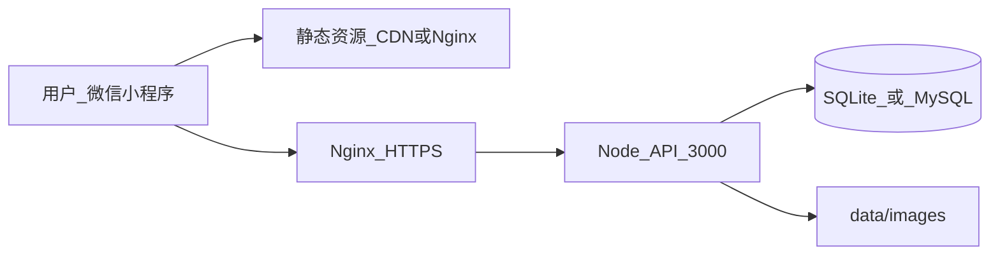

# 生产部署指南（HTTPS 体验版）

> 对应里程碑：**HTTPS 体验版上线**（第 5–8 周）  
> 前置条件：学校小程序主体审批进行中或已完成，见 [wechat-miniprogram-launch-guide.md](wechat-miniprogram-launch-guide.md)

---

## 一、部署架构



| 组件 | 建议 |
|------|------|
| API | 云服务器 2C4G，Node 22+ |
| 数据库 | 试用期 SQLite；用户 >100 迁 MySQL（见 `docs/schema.sql`） |
| 静态图 | 同机 `data/images/` 或 OSS + CDN |
| 前端 H5 | `frontend/dist/build/h5` → Nginx 静态目录 |
| 小程序 | `frontend/dist/build/mp-weixin` → 微信开发者工具上传 |

---

## 二、环境变量

```bash
cp backend/.env.example backend/.env
```

生产必填：

```env
NODE_ENV=production
PORT=3000
HOST=0.0.0.0
WECHAT_APPID=wxXXXXXXXXXXXXXXXX
WECHAT_APPSECRET=xxxxxxxxxxxxxxxxxxxxxxxxxxxxxxxx
ALLOW_DEMO_LOGIN=false
```

前端生产 API（`frontend/.env.production`）：

```env
VITE_API_BASE=https://api.yourdomain.edu.cn/api
```

---

## 三、一键部署

```bash
chmod +x scripts/deploy-production.sh
./scripts/deploy-production.sh
```

或分步：

```bash
npm run setup
npm run build:frontend
npm run build:mp-weixin
node scripts/seed-all-levels.mjs
NODE_ENV=production node backend/src/index.js
```

---

## 四、Nginx 配置

完整配置文件：**[`deploy/nginx/xiyu-vocab.conf`](../deploy/nginx/xiyu-vocab.conf)**（复制到服务器后替换域名与证书路径）

### 示例摘要

```nginx
server {
    listen 443 ssl http2;
    server_name api.yourdomain.edu.cn;

    ssl_certificate     /etc/ssl/yourdomain.crt;
    ssl_certificate_key /etc/ssl/yourdomain.key;

    location /api/ {
        proxy_pass http://127.0.0.1:3000;
        proxy_set_header Host $host;
        proxy_set_header X-Real-IP $remote_addr;
    }

    location /static/images/ {
        proxy_pass http://127.0.0.1:3000;
    }

    location /admin {
        proxy_pass http://127.0.0.1:3000;
    }
}
```

微信公众平台 → 开发设置 → 服务器域名：

- **request 合法域名**：`https://api.yourdomain.edu.cn`（不带路径）

---

## 五、体验版验收清单

- [ ] 真机微信扫码可打开小程序
- [ ] 微信登录成功（或教师批准演示登录仅限内测）
- [ ] 每日学习、错题本、统计页正常
- [ ] 管理后台 `https://api.../admin` 可查看内容进度
- [ ] 试用报告 `GET /api/admin/pilot-report` 可导出
- [ ] 隐私政策 / 用户协议页可访问

---

## 六、试用数据导出（大创中期）

```bash
# 需后端运行或直连数据库
node scripts/export-pilot-report.mjs

# 或浏览器打开管理后台 →「下载 JSON 报告」
open http://localhost:3000/admin
```

报告字段：活跃用户数、答题量、正确率、打卡、分级学习进度。  
配合西语同学 B 的问卷分析 `docs/survey/analysis.md` 写入中期报告。

---

## 七、相关文档

- [wechat-miniprogram-launch-guide.md](wechat-miniprogram-launch-guide.md)
- [school-approval-checklist.md](school-approval-checklist.md)
- [api.md](api.md) — 含 `/api/admin/pilot-report`
