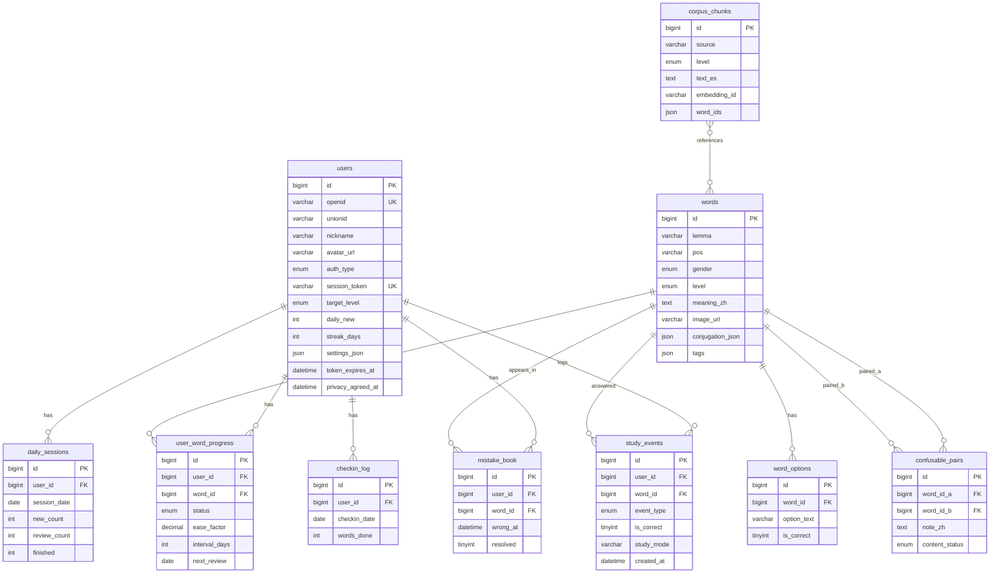

# 数据库 ER 关系图

> 完整字段说明见 [database-design.md](database-design.md)

## 表关系说明

1. **words ↔ word_options**：一对多，每词 4 个选项（1 正 3 干扰）。
2. **users ↔ user_word_progress**：SM-2 复习状态，按 `(user_id, next_review)` 索引调度。
3. **mistake_book**：答错写入，复习正确后 `resolved=1`。
4. **study_events**：每次答题/听写写入，支撑统计页与大创数据分析。
5. **users.settings_json**：发音、震动、IPA 显示等个人偏好。
6. **corpus_chunks**：RAG 语料（三期），通过 `word_ids` 关联词库。
