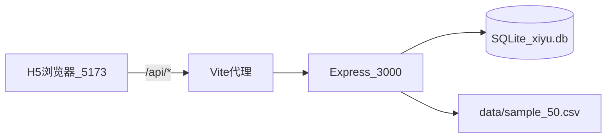

# 本地开发指南

## 环境要求

- **Node.js** 22+（后端零依赖，可直接 `node backend/src/index.js`）
- **npm**（仅前端 uni-app 需要，请从 [nodejs.org](https://nodejs.org) 安装完整 Node.js）
- **Python** 3.8+（可选，用于 CSV 校验与 MySQL 导入）

## 一键启动

```bash
# 首次：安装全部依赖
npm run setup

# 同时启动后端 API + 前端 H5
npm run dev
```

启动后访问：

| 服务 | 地址 |
|------|------|
| 前端 H5 | http://localhost:5173 |
| 后端 API | http://localhost:3000 |
| 健康检查 | http://localhost:3000/api/health |

## 分步启动

```bash
# 终端 1：后端（无需 npm install）
node backend/src/index.js

# 终端 2：前端（需先 npm install）
cd frontend && npm install && npm run dev:h5
```

## 架构说明



- **前端**：uni-app Vue3，通过 `uni.request` 调用 REST API
- **后端**：Node.js 内置 `node:http` + `node:sqlite`，零 npm 依赖，首次启动自动从 CSV 导入词库
- **数据**：用户进度、错题本、每日会话持久化在 `backend/data/xiyu.db`

## 常用命令

```bash
# 重新导入词库（修改 CSV 后）
npm run seed

# 指定 CSV 导入
node backend/src/seed.js data/sample_50.csv

# 仅启动后端
npm run dev:backend

# 构建 H5 静态包
npm run build:frontend
```

## 开发调试

### 重置学习数据

在 App **统计** 页点击「重置演示数据」，或调用：

```bash
curl -X POST http://localhost:3000/api/dev/reset \
  -H "Authorization: Bearer YOUR_TOKEN"
```

### 重置今日学习

首页「重新练习」或：

```bash
curl -X POST http://localhost:3000/api/dev/reset-today \
  -H "Authorization: Bearer YOUR_TOKEN"
```

### 词库更新流程

1. 西语同学编辑 `data/sample_50.csv` 并添加配图到 `data/images/`
2. 运行 `npm run seed` 或重启后端（空库时自动导入）
3. 删除 `backend/data/xiyu.db` 可强制全量重建

## 与 MySQL 生产环境的关系

本地使用 SQLite 便于零配置开发；上线时可：

1. 执行 [schema.sql](schema.sql) 创建 MySQL 库
2. 使用 [scripts/import_words.py](../scripts/import_words.py) 导入词库
3. 将 backend 数据库层替换为 MySQL 驱动（接口不变）

## 生产 API 与微信登录

### 后端

```bash
cp backend/.env.example backend/.env
# 填写 WECHAT_APPID、WECHAT_APPSECRET；生产设 NODE_ENV=production、ALLOW_DEMO_LOGIN=false
node backend/src/index.js
```

`/api/health` 返回 `auth.wechat` / `auth.demoLogin` 配置状态。

### 前端

| 环境 | 文件 | `VITE_API_BASE` |
|------|------|-----------------|
| H5 本地 | `.env.development` | `/api`（Vite 代理） |
| 小程序生产 | `.env.production.local` | `https://api.yourdomain.com/api` |

```bash
cp frontend/.env.production.example frontend/.env.production.local
cd frontend && npm run build:mp-weixin
```

公众平台 request 合法域名填 `https://api.yourdomain.com`（不含 `/api`）。

| 平台 | 登录 |
|------|------|
| H5 | `POST /api/login` |
| 小程序 | `uni.login` → `POST /api/auth/wechat` |

## 故障排查

| 现象 | 处理 |
|------|------|
| 首页显示「后端未连接」 | 确认 `npm run dev:backend` 已启动，访问 /api/health |
| 前端 401 | 清除 localStorage / 小程序存储中的 auth_token 后刷新 |
| 小程序登录 503 | 后端 `backend/.env` 未填 WECHAT_APPID/SECRET |
| 小程序 request 失败 | 检查合法域名与 `VITE_API_BASE` 是否一致 |
| better-sqlite3 安装失败 | 后端已改用 Node 22 内置 SQLite，无需该包 |
| 端口占用 | 设置 `PORT=3001 npm run dev:backend` 并修改 vite proxy |
