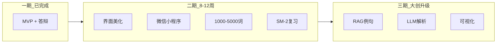
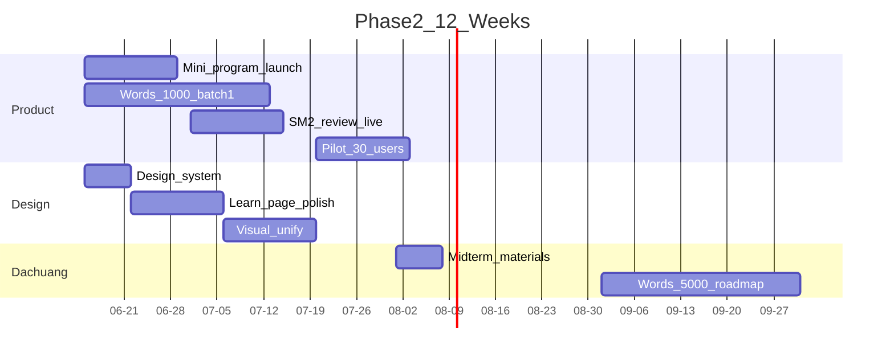

# 后续开发计划：二期功能 + 界面美化

> 基于当前 MVP（本地全栈 + 51 词 demo + 立项答辩材料）制定。  
> 建议周期：**立项后 8–12 周**，与大创中期检查对齐。

---

## 一、现状基线

| 模块 | 已完成 | 待完善 |
|------|--------|--------|
| 后端 | Node API + SQLite、答题/错题/统计 | 微信登录、SM-2 调度、MySQL 迁移 |
| 前端 | uni-app 四 Tab、API 对接 | 真实配图、动效、组件化设计系统 |
| 词库 | 51 词 CSV | 5000 词 + 统一风格配图 |
| 部署 | 本地 dev | 小程序 AppID、云服务器、CDN |

---

## 二、版本路线图



---

## 三、二期功能计划（按优先级）

### 3.1 产品功能

| 优先级 | 功能 | 说明 | 预估 |
|--------|------|------|------|
| P0 | **微信小程序上线** | 学校主体 AppID、真机预览、隐私协议页 | 2 周 |
| P0 | **词库扩容** | A1→B2 先 1000 词，再扩至 5000 | 持续（西语同学） |
| P0 | **真实配图** | 替换 emoji 占位，800×800 统一风格 | 4 周 |
| P1 | **SM-2 复习模式** | 错题本 + 到期复习词混合每日包 | 1.5 周 |
| P1 | **动词变位卡片** | 常用时态人称展开（西语专属） | 1 周 |
| P1 | **微信登录** | openid 替换 demo token，进度云同步 | 1 周 |
| P2 | **发音** | TTS 或预录 mp3，点击 lemma 播放 | 1 周 |
| P2 | **易混词辨析页** | ser/estar、por/para 等词对专题 | 1 周 |
| P2 | **管理后台** | 词库审核、CSV 导入、配图绑定 | 2 周 |

### 3.2 技术任务（你负责）

**Week 1–2：基础设施**

- [ ] 申请学校小程序主体 + AppID
- [ ] 后端迁移 MySQL（或保留 SQLite 开发 / MySQL 生产双环境）
- [ ] 配图上传腾讯云 COS / 阿里云 OSS + CDN 域名
- [x] CI：词库 `import_words.py` → 自动 seed（`npm run import:ci`）

**Week 3–4：核心学习闭环**

- [x] 实现 SM-2 调度：`GET /api/words/daily` 合并「新词 + 到期复习」
- [x] 新增 `GET /api/words/review` 错题本专项复习
- [ ] 微信小程序编译、`manifest.json` 填 AppID
- [x] 用户协议 / 隐私政策静态页

**Week 5–6：西语专属**

- [x] 词表扩展字段：`conjugation_json`（变位表）
- [x] 学习页「展开变位」组件
- [x] 易混词对 API + 错题页跳转辨析

**Week 7–8：打磨与试用**

- [ ] 院内试用 30+ 人，收集问卷（问卷见 `docs/survey/questionnaire.md`）
- [ ] 性能：词包接口 < 200ms，图片 WebP 压缩
- [x] 试用数据导出（`GET /api/admin/pilot-report`）
- [ ] 软著材料整理（见 `docs/soft-copyright-guide.md`）

### 3.3 西语同学任务（二期）

| 同学 | 任务 | 交付物 |
|------|------|--------|
| A | DELE 分级词库 1000→5000 词 | 分批 CSV |
| A | 变位表、易混词标注 | tags + 辨析文案 |
| B | 统一风格配图（见第四节） | `data/images/` + 版权台账 |
| B | 用户试用 + 文献/问卷 | 大创中期材料 |

---

## 四、界面美化设计计划

### 4.1 设计定位

**参考**：百词斩的「轻游戏化 + 大图识记」  
**差异**：西语 DELE 专业感 + 西班牙文化色，避免纯抄英语 App

| 维度 | 当前 | 目标 |
|------|------|------|
| 视觉 | 红白渐变 + emoji 占位 | 品牌色 + 真实插画 + 微动效 |
| 信息 | 文字堆叠 | 卡片层级清晰、进度可视化 |
| 情感 | 工具感 | 打卡成就感、完成庆祝动画 |

### 4.2 设计系统（Design Tokens）

建议在 `frontend/src/styles/` 建立统一变量：

```scss
// 品牌色：西班牙红 + 暖金点缀（DELE 证书感）
$primary: #C1121F;
$primary-light: #E63946;
$accent: #F4A261;        // 暖金（打卡/成就）
$success: #2A9D8F;
$error: #E76F51;
$bg-page: #FAF7F5;       // 米白底，比灰白更温暖
$bg-card: #FFFFFF;
$text-primary: #1A1A2E;
$text-secondary: #6B7280;
$radius-card: 24rpx;
$radius-btn: 999rpx;
$shadow-card: 0 8rpx 32rpx rgba(193, 18, 31, 0.08);
```

**字体**

- 中文：PingFang SC / 思源黑体
- 西语 lemma：**加粗 52–56rpx**，可考虑 `Georgia` 或引入 `Playfair Display` 增加语言气质
- IPA 音标：浅色小号，与 lemma 区分

**图标**

- Tab 栏：替换当前纯色圆点 → 线性图标（home / book / alert / chart）
- 推荐：Iconify 或自绘 SVG 导出 PNG（81×81 @3x 小程序规范）

### 4.3 分页面美化清单

#### 首页

| 项 | 方案 |
|----|------|
| Hero | 西班牙瓷砖纹样 subtle 背景 + 「¡Hola!」动效淡入 |
| 打卡 | 环形进度替代纯数字，连续 7 天解锁小徽章 |
| 等级选择 | Chip 改为 DELE 色带（A1 绿→C2 紫渐变标识） |
| CTA | 「开始今日学习」加大 + 阴影，完成态置灰并显示 ✓ |

#### 学习页（核心）

| 项 | 方案 |
|----|------|
| 配图区 | 全宽 1:1 圆角大图（百词斩式），无图时用渐变 + 线性插画 |
| 选项 | 四按钮加大触控区；选中/正确/错误 **0.2s 颜色过渡 + 轻震动**（小程序 `vibrateShort`） |
| 反馈 | 正确：绿色粒子/✓ 动画；错误：抖动 + 展开例句卡片 |
| 进度 | 顶部细进度条 + 「第 n/10 词」 |
| 扩展 | lemma 下方「🔊 发音」「📖 变位」图标按钮 |

#### 错题本

| 项 | 方案 |
|----|------|
| 列表 | 左色条标记 level；右滑「已掌握」 |
| 空态 | 插画 + 「太棒了，零错题」 |
| 详情 | 点击展开例句 + 易混词链接 |

#### 统计页

| 项 | 方案 |
|----|------|
| 概览 | 四宫格卡片加图标背景 |
| DELE 覆盖 | 横向条形图 → **ECharts 雷达图**（二期末 / 三期） |
| 打卡 | 日历热力图（GitHub 风格，浅红深浅） |

### 4.4 配图风格指南（给同学 B）

**统一规范（写进大创附件）**

1. **风格**：扁平 2.5D 或 soft gradient 插画，避免写实照片风格混杂  
2. **色板**：主色不超过 5 种，与 App 红白金协调  
3. **构图**：主体居中，留 10% 边距，便于圆角裁剪  
4. **动词**：动作场景（hablar → 说话的人）  
5. **抽象词**（por/para）：符号化场景（箭头、路径）  
6. **交付**：800×800 JPG/WebP + 命名 `lemma.jpg` + COPYRIGHT 台账  

**分批制作**

- Batch 1（答辩后 2 周）：A1 核心 100 词  
- Batch 2（第 4–6 周）：A2 + B1 各 300 词  
- Batch 3（第 8–12 周）：B2 及以后  

### 4.5 前端工程任务（界面专项）

| 周次 | 任务 |
|------|------|
| W1 | 抽离 `styles/theme.scss`、`components/AppCard.vue`、`AppButton.vue` |
| W2 | 首页 + 学习页视觉改版；接入真实 `image_url` |
| W3 | 答题动效、进度条、Tab 图标替换 |
| W4 | 错题本/统计页改版；空态插画 |
| W5 | 小程序适配（安全区、胶囊按钮间距） |
| W6 | 深色模式（可选，大创加分项） |

---

## 五、三期预览（大创国家级方向）

与二期并行调研，不阻塞上线：

| 模块 | 内容 | 时间 |
|------|------|------|
| RAG | DELE 语料向量库 + 可溯源例句 | 立项后 4–6 月 |
| LLM | 错题解析、易混词生成（人工审核） | 同上 |
| 可视化 | 掌握热力图、遗忘曲线、对照实验 | 中期后 |
| 成果 | 软著 1 项、论文 1 篇、100+ 用户数据 | 结题前 |

---

## 六、里程碑与检查点



| 节点 | 日期（建议） | 验收标准 |
|------|--------------|----------|
| M1 内测版 | 立项 +2 周 | 小程序可预览，100 词 + 配图 |
| M2 公测版 | +6 周 | SM-2、微信登录、1000 词 |
| M3 中期 | +8 周 | 30 用户数据、界面定稿、软著申报 |
| M4 二期结项 | +12 周 | 5000 词路线图清晰、RAG 原型 demo |

---

## 七、分工总表

| 角色 | 二期重点 | 产出 |
|------|----------|------|
| **技术（你）** | 小程序、SM-2、OSS、UI 组件化、后台 | 可上线产品 |
| **西语 A** | 词库、变位、易混词、例句 | CSV + 质检报告 |
| **西语 B** | 配图、风格指南执行、用户调研 | 图库 + 问卷分析 |
| **共同** | 大创中期 ppt、试用反馈迭代 | 中期检查通过 |

---

## 八、近期建议（答辩后第一周）

1. **你**：按 4.5 节抽离 `theme.scss`，改学习页大图布局（1 天可出 visible 变化）  
2. **同学 B**：定 1 张「风格样张」（如 hablar / casa）三人评审后再批量  
3. **共同**：走学校创院申请小程序主体（周期 often 2–4 周，尽早提交）  
4. **词库**：先锁定 A1 100 词清单，不追求一次 5000  

---

## 九、相关文档

- [architecture.md](architecture.md) — 技术架构  
- [api.md](api.md) — 接口（二期扩展 SM-2 / 变位字段）  
- [spanish-content-guide.md](spanish-content-guide.md) — 词库与配图规范  
- [defense-ppt-outline.md](defense-ppt-outline.md) — 答辩后可改为中期 ppt 骨架  
