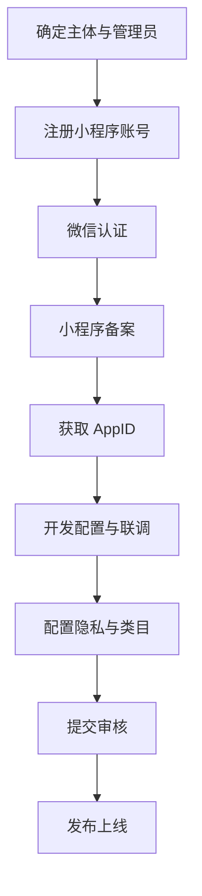

# 微信小程序申请与上线指南

> 适用本项目「西语背单词」uni-app 工程。  
> **完整审批流程（含校内立项 → 上架）** 见 **[wechat-registration-approval-flow.md](wechat-registration-approval-flow.md)**  
> **登录体系** 见 **[auth-system.md](auth-system.md)**  
> 官方入口：[微信公众平台](https://mp.weixin.qq.com/)

---

## 一、先选主体：你们该用哪种？

| 主体类型 | 适合场景 | 教育类能力 | 建议 |
|----------|----------|------------|------|
| **学校/院系（组织）** | 大创、院系项目 | 完整 | **首选** |
| **企业** | 公司运营 | 完整 | 有公司主体时 |
| **个人** | 个人开发者 | 受限，部分类目不可选 | 不推荐（教育类常受限） |

**推荐路径**：通过 **创新创业学院 / 教务处 / 网信中心** 以 **学校组织主体** 注册，或使用学校已有 **教育类服务号/小程序主体** 复用。

需要向院系确认：

- [ ] 是否允许学生项目使用学校主体
- [ ] 谁担任 **管理员**（通常需教师）
- [ ] 认证费用谁承担（组织认证约 **300 元/年**，以平台为准）
- [ ] 是否需走 **校内网信/法务** 审批

---

## 二、整体流程（时间线）



| 阶段 | 典型耗时 | 说明 |
|------|----------|------|
| 校内审批 | 1–4 周 | 因学校而异，**尽早启动** |
| 注册 + 认证 | 3–7 天 | 对公账户验证可能更久 |
| 小程序备案 | 5–20 个工作日 | 2023 年起新小程序需备案 |
| 开发与联调 | 1–3 周 | 你们 uni-app 已基本就绪 |
| 首次审核 | 1–7 天 | 教育类一般 1–3 天 |

**答辩前若来不及**：继续用 **H5 演示**；同步走主体申请，答辩说明「已提交注册」。

---

## 三、注册小程序（Step by Step）

### 3.1 注册账号

1. 打开 https://mp.weixin.qq.com/ → **立即注册** → 选择 **小程序**
2. 填写 **未绑定** 的邮箱（建议项目专用，如 `xiyu-vocab@学校域名`）
3. 邮箱激活 → 选择主体类型（**政府/其他组织** 或 **企业**，按学校要求）
4. 填写组织信息：
   - 组织名称（与证照一致）
   - 统一社会信用代码
   - 上传 **组织机构代码证 / 事业单位法人证书 / 营业执照** 等
5. 设置 **管理员**（需微信扫码，建议指导教师 + 学生协助）
6. 完成注册

### 3.2 微信认证（强烈建议）

路径：**设置 → 微信认证**

- 未认证：功能受限，部分接口不可用，信任度低
- 认证后：可完整使用支付、客服等（你们初期可能不用支付）
- 准备：对公账户或法人扫脸验证、认证公函（学校模板）

### 3.3 获取 AppID

路径：**开发 → 开发管理 → 开发设置 → AppID(小程序ID)**

复制 AppID，填入本项目：

```json
// frontend/src/manifest.json → mp-weixin.appid
{
  "mp-weixin": {
    "appid": "wxXXXXXXXXXXXXXXXX",
    "setting": { "urlCheck": true },
    "__usePrivacyCheck__": true
  }
}
```

微信开发者工具项目配置可参考 [`frontend/project.config.example.json`](../frontend/project.config.example.json)（复制为 `project.config.json` 并填入 AppID）。

**上线前必填配置**（院系名、联系邮箱）：[`frontend/src/config/app.js`](../frontend/src/config/app.js)

---

## 四、小程序备案（必做）

2023 年 9 月起，新小程序需完成 **小程序备案** 方可上架。

路径：**设置 → 基本设置 → 小程序备案** 或按公众平台引导

准备材料通常包括：

| 材料 | 说明 |
|------|------|
| 主体证照 | 与注册一致 |
| 管理员信息 | 身份证 |
| 小程序名称 | 与证照无冲突 |
| **服务器域名** | 见下文「服务器与域名」 |
| 承诺书 | 平台模板 |

备案审核通过前，**无法正式发布**（开发版、体验版可用）。

备案指南：[小程序备案文档](https://developers.weixin.qq.com/miniprogram/product/record/guidelines.html)

---

## 五、服务器与域名配置

### 5.1 你们需要什么

- **HTTPS 后端 API**（生产环境，非 localhost）
- 可选：**对象存储 CDN** 存放单词配图

推荐（学生项目）：

- 微信 **云开发**（免备案域名配置部分流程，但仍需小程序备案）
- 或 腾讯云/阿里云 **轻量服务器 + 域名 + SSL**

### 5.2 微信公众平台配置域名

路径：**开发 → 开发管理 → 开发设置 → 服务器域名**

| 类型 | 示例 | 本项目 |
|------|------|--------|
| request 合法域名 | `https://api.yourdomain.com` | 后端 API |
| uploadFile | 若用户上传 | 初期 **无 UGC 可不配** |
| downloadFile | 若拉取文件 | 可选 |
| **业务域名** | H5  web-view 打开协议页 | 隐私政策若用 web-view |

注意：

- 必须是 **HTTPS**，有效证书
- 域名需 **备案**（国内服务器）
- 本地开发可在开发者工具勾选「不校验合法域名」

### 5.3 后端改造清单

上线前需将 H5 的 `/api` 代理改为生产地址：

```bash
# 构建小程序
cd frontend && npm run build:mp-weixin
```

在 `frontend/src/utils/api.js` 中生产环境使用：

```javascript
export const API_BASE = import.meta.env.VITE_API_BASE || 'https://api.yourdomain.com/api'
```

构建时传入：

```bash
# 推荐：写入 frontend/.env.production.local 后
npm run build:mp-weixin

# 或单次指定
VITE_API_BASE=https://api.yourdomain.com/api npm run build:mp-weixin
```

**后端** 复制 `backend/.env.example` → `backend/.env`，填写 `WECHAT_APPID` / `WECHAT_APPSECRET`（须与小程序 AppID 一致）。小程序端 `uni.login` 自动走 `POST /api/auth/wechat`。

---

## 六、类目与审核材料

### 6.1 服务类目（重要）

路径：**设置 → 基本设置 → 服务类目**

推荐选择：

| 一级 | 二级 | 说明 |
|------|------|------|
| 教育 | 在线教育 | 语言学习、背单词 |
| 或 教育 | 教育信息服务 | 若不含在线课程售卖 |

**所需资质（因类目而异，以审核页为准）**：

- 学校主体： often 事业单位法人证书 + **学校说明函/授权书**
- 若涉及 DELE 等考试培训表述，避免「官方合作」等未授权宣传

### 6.2 小程序名称与简介

- **名称**：西语背单词 / DELE西语识记 等（不与现有商标冲突）
- **简介**：面向 DELE 的西语词汇学习工具，含分级词库与复习功能
- **避免**：「官方 DELE」「保证过级」等绝对化用语

---

## 七、隐私合规（审核必过项）

### 7.1 用户隐私保护指引

路径：**设置 → 基本设置 → 用户隐私保护指引**

按平台向导填写采集项，本项目建议声明：

| 采集项 | 用途 | 是否必需 |
|--------|------|----------|
| 微信昵称、头像 | 展示 | 可选 |
| openid | 用户识别、进度同步 | 是 |
| 学习记录 | 进度、错题本、统计 | 是 |

**不采集**：手机号、位置、通讯录（除非后续新增功能）

### 7.2 隐私政策与用户协议

本项目已预留页面：

- `frontend/src/pages/legal/privacy.vue` — 隐私政策
- `frontend/src/pages/legal/terms.vue` — 用户协议

**上线前必须**：

- [ ] 补充 **联系邮箱 / 院系名称**
- [ ] 法务或指导教师审阅
- [x] 首次打开隐私同意页（`pages/legal/consent`，`App.vue` 启动检测）

### 7.3 内容合规

- 词库、例句：**西语同学质检**，无敏感内容
- 配图：**版权台账**（`data/images/COPYRIGHT.md`）
- 无 UGC 初期：**不上传用户内容**，审核更易通过

---

## 八、开发、预览与上传

### 8.1 本地编译

```bash
source scripts/env.sh
cd frontend
npm install
npm run dev:mp-weixin    # 开发预览
npm run build:mp-weixin  # 生产构建
```

产物目录：`frontend/dist/build/mp-weixin/`

### 8.2 微信开发者工具

1. 下载：[微信开发者工具](https://developers.weixin.qq.com/miniprogram/dev/devtools/download.html)
2. 导入项目 → 选择 `dist/build/mp-weixin`
3. 填入 **AppID**（勿长期用测试号，上线需正式 AppID）
4. 预览 → 扫码真机测试

### 8.3 上传代码

开发者工具 → **上传** → 填写版本号与备注

### 8.4 提交审核

路径：**管理 → 版本管理 → 开发版本 → 提交审核**

填写：

- 功能页面截图（首页、学习、错题本、统计）
- 测试账号（若需登录；你们可用微信一键登录则说明）
- 审核说明（模板见下节）

---

## 九、审核说明模板（可直接改）

```
【产品说明】
本小程序为西班牙语 DELE 分级背单词学习工具，面向高校西语专业学生。
核心功能：每日词包学习、四选一识记、错题本、学习统计。
无用户生成内容（UGC），无社交、无支付。

【测试说明】
1. 打开小程序自动进入首页
2. 点击「开始今日学习」完成识记流程
3. 故意答错可在「错题本」查看
4. 词库为项目组自制，配图版权见备查材料

【隐私说明】
仅采集微信 openid 与学习进度，用于个人数据同步。
已配置《用户协议》与《隐私政策》页面。
```

---

## 十、常见驳回原因与对策

| 驳回原因 | 对策 |
|----------|------|
| 类目资质不全 | 补学校说明函 / 换「教育信息服务」 |
| 隐私指引未配置 | 完成隐私保护指引 + 协议页 |
| 域名不在白名单 | 开发设置中添加 request 合法域名 |
| 内容涉及考试「官方」 | 文案改为「参考 DELE 分级」 |
| 功能不完整 | 确保审核路径可走完，无空白页 |
| 个人主体类目不符 | 换学校组织主体 |

---

## 十一、上线后 checklist

- [ ] 发布正式版（非仅体验版）
- [ ] 配置 **用户反馈** 入口（设置页或关于页）
- [ ] 监控 **运维**：API 可用性、错误日志
- [ ] 词库更新流程：`seed` → 服务端部署
- [ ] 定期备份数据库
- [ ] 大创材料：截图、用户数、版本迭代记录

---

## 十二、与本项目的对应关系

| 指南步骤 | 项目内位置 |
|----------|------------|
| AppID | [`frontend/src/manifest.json`](../frontend/src/manifest.json) |
| 隐私/协议 | [`frontend/src/pages/legal/`](../frontend/src/pages/legal/) |
| 首次隐私同意 | [`frontend/src/pages/legal/consent.vue`](../frontend/src/pages/legal/consent.vue) + [`frontend/src/config/app.js`](../frontend/src/config/app.js) |
| 校内审批清单 | [`docs/school-approval-checklist.md`](school-approval-checklist.md) |
| 后端 API | [`backend/`](../backend/) → 需部署 HTTPS |
| 词库导入 | [`scripts/import_words.py`](../scripts/import_words.py) |
| 配图 CDN | [`data/images/`](../data/images/) |
| 合规说明 | [`docs/compliance.md`](compliance.md) |
| 内容缺口 | http://localhost:3000/admin |

---

## 十三、建议你们立刻做的 3 件事

1. **找指导教师 / 创院**：确认学校主体注册流程与 timeline（材料清单见 [`school-approval-checklist.md`](school-approval-checklist.md)）  
2. **买域名 + 部署后端**（或开通微信云开发）：没有 HTTPS 域名无法正式上架  
3. **补全隐私政策联系方式**，并让西语同学开始填 **A1 词库 + 30 张配图**（审核时内容不能太空）

---

## 十四、参考链接

- [微信公众平台](https://mp.weixin.qq.com/)
- [小程序开发文档](https://developers.weixin.qq.com/miniprogram/dev/framework/)
- [小程序备案指引](https://developers.weixin.qq.com/miniprogram/product/record/guidelines.html)
- [用户隐私保护指引](https://developers.weixin.qq.com/miniprogram/dev/framework/user-privacy/)
- [uni-app 发布到微信小程序](https://uniapp.dcloud.net.cn/tutorial/build/publish-mp-weixin.html)

---

**文档维护**：上线过程中若学校/平台政策有变，以微信官方最新要求为准；可在本项目 `docs/` 下追加「本校审批记录」附录。
