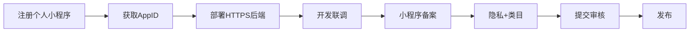

# 个人主体微信小程序 · 注册上架全流程

> 适用：**个人开发者**注册「西语背单词」  
> 优势：无需学校审批，注册快  
> 限制：部分教育类目受限、无对公支付（本项目无支付，影响小）

相关：[登录体系](auth-system.md) · [数据库设计](database-design.md) · [UI 设计系统](ui-design-system.md)

---

## 一、个人 vs 学校主体

| 对比项 | 个人主体 | 学校组织主体 |
|--------|----------|--------------|
| 注册难度 | ⭐ 低，身份证即可 | ⭐⭐⭐ 需院系审批 |
| 认证费 | 30 元/年（个人） | ~300 元/年 |
| 教育类目 | **受限**，选「工具-效率」或「教育-教育信息服务」 | 完整 |
| 大创申报 | 可作个人作品展示 | 更适合正式大创材料 |
| **推荐** | **个人开发/试用/答辩** | 校级正式上线 |

---

## 二、全流程（约 3–5 周）



| 步骤 | 耗时 | 产出 |
|------|------|------|
| 1. 注册 | 10 分钟 | 邮箱账号 |
| 2. 实名 + AppID | 即时 | AppID |
| 3. 买域名 + 备案 | 7–20 天 | HTTPS API |
| 4. 开发联调 | 3–7 天 | 体验版 |
| 5. 小程序备案 | 5–15 天 | 可提审 |
| 6. 审核 | 1–7 天 | 上线 |

---

## 三、Step 1：注册个人小程序

1. 打开 https://mp.weixin.qq.com/ → **立即注册** → **小程序**
2. 未绑定邮箱注册并激活
3. 主体类型选 **个人**
4. 管理员微信扫码（你自己）
5. 填写姓名、身份证号、手机（人脸核身）
6. 完成注册

> 个人主体无需事业单位证照、无需学校审批。

---

## 四、Step 2：获取 AppID 与 AppSecret

路径：**开发 → 开发管理 → 开发设置**

1. 复制 **AppID** → `frontend/src/manifest.json`

```json
"mp-weixin": {
  "appid": "wx你的AppID",
  "__usePrivacyCheck__": true
}
```

2. 生成 **AppSecret**（只显示一次）→ `backend/.env`

```env
WECHAT_APPID=wx你的AppID
WECHAT_APPSECRET=你的Secret
NODE_ENV=production
ALLOW_DEMO_LOGIN=false
```

3. 填写 `frontend/src/config/app.js`：

```javascript
orgName: '个人开发者',  // 或你的昵称/品牌
contactEmail: '你的真实邮箱',  // 审核必填
showDevBanner: false,
subjectType: 'personal',
```

---

## 五、Step 3：服务器与域名

个人开发者同样需要 **HTTPS + 备案域名**（国内服务器）。

### 推荐方案（学生）

| 方案 | 费用 | 说明 |
|------|------|------|
| 腾讯云轻量 + 域名 | ~50–100 元/年 | 最常见 |
| 微信云开发 | 有免费额度 | 可简化后端部署 |

### 部署

```bash
./scripts/deploy-production.sh
```

`frontend/.env.production`：

```env
VITE_API_BASE=https://api.你的域名.com/api
```

### 公众平台配置

**开发 → 开发设置 → 服务器域名**

| 类型 | 域名 |
|------|------|
| request | `https://api.你的域名.com` |
| uploadFile | 同上（头像上传） |

---

## 六、Step 4：本地开发与体验版

```bash
npm run dev                              # H5 调试
cd frontend && npm run dev:mp-weixin     # 小程序开发
npm run build:mp-weixin                  # 生产构建
```

微信开发者工具：

1. 导入 `frontend/dist/build/mp-weixin`
2. 填入 AppID
3. 开发阶段可勾选「不校验合法域名」
4. 预览 → 真机测试登录
5. 上传代码 → 设为体验版

### 登录验收

- [ ] 隐私同意页 → 微信登录 → 首页
- [ ] 学习答题后统计页有数据
- [ ] 退出登录后需重新登录
- [ ] `study_events` 表有记录（行为日志）

---

## 七、Step 5：小程序备案

路径：**设置 → 基本设置 → 小程序备案**

- 个人备案需身份证
- 填写已备案的服务器域名
- 体验版可用，**正式发布需备案通过**

---

## 八、Step 6：类目与隐私（个人关键）

### 服务类目（个人可选）

| 推荐一级 | 二级 | 说明 |
|----------|------|------|
| **工具** | 效率 | 语言学习工具，个人较易过 |
| 教育 | 教育信息服务 | 可能需要补充说明，无资质时慎选「在线教育」 |

避免选择需要 **培训机构许可证** 的类目。

### 用户隐私保护指引

路径：**设置 → 用户隐私保护指引**

声明采集：

- 微信 openid（用户识别）
- 昵称、头像（自愿完善）
- 学习记录（进度同步）

### 协议页面

项目已内置，上线前改 `app.js` 邮箱：

- `pages/legal/privacy.vue`
- `pages/legal/terms.vue`
- `pages/legal/consent.vue`

---

## 九、Step 7：提交审核

**管理 → 版本管理 → 提交审核**

### 审核说明（个人版）

```
【产品说明】
个人开发的西班牙语 DELE 分级背单词工具。
功能：每日词包、四选一识记、错题本、SM-2 复习、学习统计。
无 UGC、无社交、无支付、无广告。

【登录】微信一键登录，仅采集 openid 与学习进度。

【测试】打开 → 同意隐私 → 微信登录 → 开始学习即可体验。
```

### 常见驳回（个人）

| 原因 | 处理 |
|------|------|
| 类目不符 | 改「工具-效率」 |
| 隐私未配置 | 完成隐私指引 + 协议页 |
| 联系邮箱无效 | 改 `app.js` 真实邮箱 |
| 功能不完整 | 真机走通全流程 |

---

## 十、费用估算（个人）

| 项目 | 费用 |
|------|------|
| 个人认证 | 30 元/年 |
| 域名 | ~50 元/年 |
| 轻量服务器 | ~60 元/年 |
| **合计** | **约 140 元/年** |

---

## 十一、与大创的关系

个人主体上线后仍可：

- 作为 **作品演示**（答辩、截图、用户数）
- 数据库 `study_events` 导出试用数据
- 后期若需正式大创材料，可再迁移至学校主体（用户数据需迁移方案）

---

## 十二、配置检查清单

- [ ] `manifest.json` AppID
- [ ] `backend/.env` AppID + Secret
- [ ] `app.js` 联系邮箱
- [ ] `VITE_API_BASE` 生产域名
- [ ] 服务器域名白名单
- [ ] 隐私保护指引
- [ ] 服务类目
- [ ] 小程序备案
- [ ] 真机全流程测试
