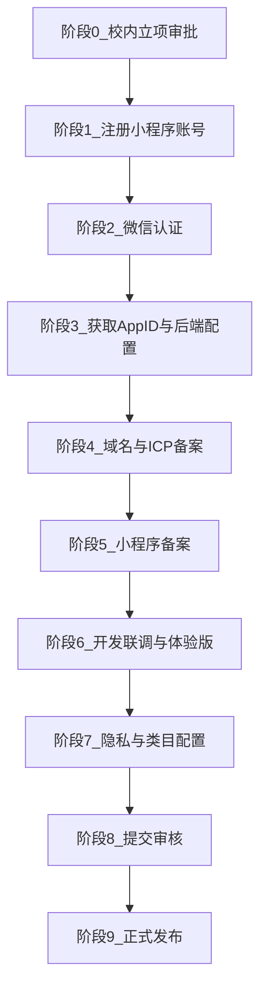
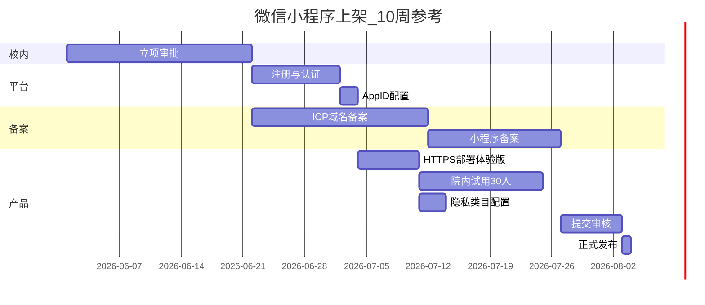

# 微信小程序注册审批全流程

> **从零到上架**的完整路径，含校内审批、平台注册、备案、开发与审核。  
> 适用项目：西语背单词（大创 · 学校组织主体）  
> 预计总周期：**6–10 周**（校内审批占大头）

相关文档：
- [登录体系说明](auth-system.md)
- [微信小程序上线指南](wechat-miniprogram-launch-guide.md)（技术配置细节）
- [校内审批清单](school-approval-checklist.md)
- [一页纸申请说明](school-approval-application.md)

---

## 流程总览



| 阶段 | 名称 | 典型耗时 | 关键产出 |
|:----:|------|----------|----------|
| 0 | 校内立项审批 | 1–4 周 | 主体确认函、经费、管理员 |
| 1 | 注册小程序 | 1–3 天 | 邮箱账号、组织信息 |
| 2 | 微信认证 | 3–7 天 | 认证通过、完整权限 |
| 3 | AppID 与开发配置 | 1 天 | AppID、AppSecret、`.env` |
| 4 | 域名 ICP 备案 | 7–20 工作日 | `https://api.xxx.edu.cn` |
| 5 | 小程序备案 | 5–20 工作日 | 备案号、可提交审核 |
| 6 | 开发联调 | 1–2 周 | 体验版二维码 |
| 7 | 隐私与类目 | 2–3 天 | 协议页、服务类目 |
| 8 | 提交审核 | 1–7 天 | 审核通过 |
| 9 | 正式发布 | 即时 | 线上可搜索 |

---

## 阶段 0：校内立项审批（最先启动）

**为什么先做**：没有学校主体和管理员，后续注册无法进行。此阶段可与技术开发并行。

### 0.1 角色分工

| 角色 | 任务 |
|------|------|
| **指导教师** | 确认挂靠学校主体、担任或指定小程序管理员、审阅申请材料 |
| **学生负责人** | 整理立项书、功能截图、填写 [school-approval-checklist.md](school-approval-checklist.md) |
| **技术同学** | 提供 H5 演示链接、架构图、隐私政策草案 |
| **创院/院系** | 审批立项、明确认证费出处（约 300 元/年） |
| **网信中心** | （备案阶段介入）域名与 ICP 备案流程 |

### 0.2 提交材料

1. [school-approval-application.md](school-approval-application.md)（或 Word/PDF 版）
2. 立项书 / 大创申报书摘要
3. 产品截图 4–6 张（首页、学习、错题、统计）
4. 隐私政策 + 用户协议草案（`frontend/src/pages/legal/`）
5. 团队分工表（西语 A/B + 技术）

### 0.3 院系需书面确认

- [ ] 允许以 **学校/事业单位组织主体** 注册微信小程序
- [ ] **管理员** 微信实名（建议指导教师）
- [ ] 学生作为开发者/运营协助的授权
- [ ] 微信认证 **300 元/年** 经费来源
- [ ] 项目专用注册邮箱（建议 `@学校域名`）

### 0.4 产出物

《主体使用确认函》或院系批复邮件 → 进入阶段 1。

---

## 阶段 1：注册小程序账号

**平台**：[微信公众平台](https://mp.weixin.qq.com/) → 立即注册 → **小程序**

### 步骤

| 步 | 操作 | 注意 |
|:--:|------|------|
| 1 | 填写未绑定邮箱，激活 | 建议 `xiyu-vocab@学校域名` |
| 2 | 选择主体：**政府 / 其他组织**（学校） | 勿选个人（教育类目受限） |
| 3 | 填写组织名称、统一社会信用代码 | 与法人证书一致 |
| 4 | 上传事业单位法人证书 / 组织机构代码证 | 加盖公章扫描件 |
| 5 | 管理员扫码绑定 | **指导教师微信** |
| 6 | 完成注册 | 记录登录邮箱密码 |

### 常见卡点

- 证照名称与填写组织名不一致 → 按证书逐字填写
- 管理员未满 18 岁 → 换教师或成年工作人员

---

## 阶段 2：微信认证

路径：**设置 → 微信认证**

| 项 | 说明 |
|----|------|
| 费用 | 约 **300 元/年**（对公或法人验证） |
| 材料 | 认证公函（学校模板）、对公账户或法人扫脸 |
| 未认证后果 | 接口受限、用户信任度低、部分类目不可用 |

**建议**：大创项目务必完成认证。

---

## 阶段 3：获取 AppID 与项目配置

路径：**开发 → 开发管理 → 开发设置**

### 3.1 复制凭证

| 字段 | 填入位置 |
|------|----------|
| **AppID** | `frontend/src/manifest.json` → `mp-weixin.appid` |
| **AppSecret** | `backend/.env` → `WECHAT_APPSECRET`（**仅后端**） |

```bash
cp backend/.env.example backend/.env
# 编辑 WECHAT_APPID、WECHAT_APPSECRET
```

### 3.2 填写项目信息

| 文件 | 内容 |
|------|------|
| `frontend/src/config/app.js` | 院系全称、联系邮箱、指导教师 |
| `frontend/.env.production` | `VITE_API_BASE=https://api.yourdomain.edu.cn/api` |

### 3.3 生成 AppSecret

开发设置 → AppSecret → **生成**（只显示一次，立即保存到 `.env`）

---

## 阶段 4：域名与 ICP 备案

**前置**：国内服务器 + 已购域名（建议 `api.学校缩写.edu.cn` 或院系子域）

### 4.1 技术部署

```bash
./scripts/deploy-production.sh
```

详见 [deploy-production.md](deploy-production.md)

### 4.2 ICP 备案（工信部）

通过云厂商（腾讯云/阿里云）或学校网信中心提交：

| 材料 | 说明 |
|------|------|
| 主体证照 | 同注册主体 |
| 域名证书 | 域名归属证明 |
| 负责人身份证 | 学生或教师 |
| 网站备案信息表 | 云厂商模板 |
| 承诺书 | 学校盖章 |

**周期**：7–20 个工作日

### 4.3 配置 HTTPS

- 申请 SSL 证书（云厂商免费证书即可）
- Nginx 反代 `https://api.xxx.edu.cn` → `localhost:3000`

### 4.4 微信公众平台域名白名单

路径：**开发 → 开发设置 → 服务器域名**

| 类型 | 填写 | 本项目 |
|------|------|--------|
| request 合法域名 | `https://api.xxx.edu.cn` | **必填**（不带 `/api` 路径） |
| uploadFile | 同 API 域名 | 头像上传需要 |
| downloadFile | 可选 | 配图 CDN 时用 |

---

## 阶段 5：小程序备案

2023 年 9 月起，**新小程序须完成小程序备案方可上架**。

路径：**设置 → 基本设置 → 小程序备案**（按平台引导）

| 材料 | 说明 |
|------|------|
| 主体信息 | 自动带入 |
| 小程序名称 | 与阶段 7 一致 |
| 服务器域名 | 已备案的 API 域名 |
| 负责人信息 | 管理员身份证 |
| 承诺书 | 平台模板 |

- **体验版、开发版**：备案审核期间可用
- **正式发布**：须备案通过

官方指引：[小程序备案文档](https://developers.weixin.qq.com/miniprogram/product/record/guidelines.html)

---

## 阶段 6：开发联调与体验版

### 6.1 本地开发

```bash
npm run dev                    # H5
cd frontend && npm run dev:mp-weixin   # 小程序开发模式
```

### 6.2 生产构建

```bash
npm run build:mp-weixin
```

产物：`frontend/dist/build/mp-weixin/`

### 6.3 微信开发者工具

1. 下载 [开发者工具](https://developers.weixin.qq.com/miniprogram/dev/devtools/download.html)
2. 导入 `dist/build/mp-weixin`，填入正式 **AppID**
3. 详情 → 本地设置 → 开发阶段可勾选「不校验合法域名」
4. **预览** → 扫码真机测试登录与学习流程
5. **上传** → 填写版本号备注

### 6.4 发布体验版

路径：**管理 → 版本管理 → 开发版本 → 选为体验版**

- 添加体验成员（指导教师、西语同学、试用学生）
- 生成体验版二维码 → 院内试用 + 问卷（目标 30 人）

### 6.6 登录验收清单

- [ ] `uni.login` 成功获取 code
- [ ] `POST /api/auth/wechat` 返回 token
- [ ] 学习进度可保存、换设备可同步（同一微信）
- [ ] 退出登录后旧 token 失效
- [ ] 头像上传（uploadFile 域名已配置）

---

## 阶段 7：隐私合规与服务类目

### 7.1 用户隐私保护指引

路径：**设置 → 基本设置 → 用户隐私保护指引**

| 采集项 | 用途 | 是否采集 |
|--------|------|:--------:|
| 微信 openid | 用户识别、进度同步 | ✅ |
| 昵称 | 个人展示 | ✅ |
| 头像 | 个人展示 | ✅ |
| 学习记录 | 错题本、统计、SM-2 | ✅ |
| 手机号 | — | ❌ |
| 位置 | — | ❌ |

### 7.2 协议页面（本项目已内置）

- `pages/legal/consent` — 首次启动同意
- `pages/legal/privacy` — 隐私政策
- `pages/legal/terms` — 用户协议

**上线前**：补全 `app.js` 中院系名与邮箱，**指导教师审阅签字**。

### 7.3 服务类目

路径：**设置 → 基本设置 → 服务类目**

推荐：

| 一级 | 二级 |
|------|------|
| 教育 | **在线教育** 或 **教育信息服务** |

资质（以审核页为准）：

- 事业单位法人证书
- **学校说明函 / 授权书**（院系模板）
- 避免「DELE 官方合作」等未授权表述

### 7.4 小程序名称与简介

- **名称**：西语背单词 / DELE西语识记（不与商标冲突）
- **简介**：面向 DELE 分级体系的西语词汇学习工具，含识记、复习与统计
- **禁止**：「保证过级」「官方 DELE」

---

## 阶段 8：提交审核

路径：**管理 → 版本管理 → 开发版本 → 提交审核**

### 8.1 审核材料

| 项 | 内容 |
|----|------|
| 功能页面 | 首页、学习、错题本、统计（截图或录屏） |
| 测试账号 | 微信一键登录，说明「无需额外账号」 |
| 审核说明 | 见下方模板 |
| 补充材料 | 词库自制说明、配图版权台账（备查） |

### 8.2 审核说明模板

```
【产品说明】
本小程序为西班牙语 DELE 分级背单词学习工具，面向高校西语专业学生。
核心功能：每日词包、四选一识记、SM-2 间隔复习、错题本、学习统计、听写练习。
无用户生成内容（UGC），无社交、无支付、无广告。

【登录说明】
使用微信一键登录（uni.login + 服务端 jscode2session），
仅采集 openid 用于学习进度同步，昵称头像由用户自愿完善。

【测试路径】
1. 打开 → 同意隐私政策
2. 微信一键登录 → 可选完善头像昵称
3. 首页选 DELE 等级 → 开始今日学习
4. 答错后可在错题本查看
5. 统计页查看进度与打卡

【合规说明】
已配置《用户协议》《隐私政策》；词库与配图由项目组自制并留存版权记录。
```

### 8.3 常见驳回与对策

| 驳回原因 | 对策 |
|----------|------|
| 类目资质不全 | 补学校说明函；换「教育信息服务」 |
| 隐私指引未配置 | 完成指引 + 协议可访问 |
| 域名不在白名单 | 开发设置添加 request / uploadFile 域名 |
| 内容涉「官方考试」 | 文案改为「参考 DELE 分级」 |
| 功能路径不通 | 审核前真机走通全流程 |
| 个人主体类目不符 | 换学校组织主体 |

---

## 阶段 9：正式发布

备案通过 + 审核通过后：

路径：**管理 → 版本管理 → 审核版本 → 发布**

### 上线后 checklist

- [ ] 正式版（非仅体验版）可搜索
- [ ] 监控 API 可用性
- [ ] 定期备份 `backend/data/xiyu.db`
- [ ] 词库更新：`npm run seed:all` → 重启服务
- [ ] 导出试用数据：`npm run export:pilot`
- [ ] 大创中期材料截图归档

---

## 全员时间线（甘特参考）



---

## 快速对照：谁做什么

| 事项 | 指导教师 | 学生负责人 | 技术 | 西语 A | 西语 B | 网信/创院 |
|------|:--------:|:----------:|:----:|:------:|:------:|:---------:|
| 主体确认函 | 签 | 递 | | | | 批 |
| 注册小程序 | 管理员扫码 | 填表 | | | | |
| 认证缴费 | 批经费 | 经办 | | | | |
| 部署 API | | 协调 | **做** | | | 备案 |
| 填 AppID/.env | | | **做** | | | |
| 隐私政策审阅 | **审** | 整理 | 提供页 | | | |
| 配图版权 | | | | | **做** | |
| 词库校对 | | | 导入 | **做** | | |
| 体验版试用 | 验收 | 推广 | 修 Bug | | **问卷** | |
| 提交审核 | 知情 | 填说明 | 截图 | | | |

---

## 本项目配置速查

| 配置项 | 文件 |
|--------|------|
| AppID | `frontend/src/manifest.json` |
| AppSecret | `backend/.env` |
| API 地址 | `frontend/.env.production` |
| 院系信息 | `frontend/src/config/app.js` |
| 登录逻辑 | [auth-system.md](auth-system.md) |
| 部署 | [deploy-production.md](deploy-production.md) |

---

## 官方参考链接

- [微信公众平台](https://mp.weixin.qq.com/)
- [小程序注册流程](https://developers.weixin.qq.com/miniprogram/dev/framework/quickstart/getstart.html)
- [小程序备案指引](https://developers.weixin.qq.com/miniprogram/product/record/guidelines.html)
- [用户隐私保护指引](https://developers.weixin.qq.com/miniprogram/dev/framework/user-privacy/)
- [jscode2session](https://developers.weixin.qq.com/miniprogram/dev/OpenApiDoc/user-login/code2Session.html)
- [uni-app 发布微信小程序](https://uniapp.dcloud.net.cn/tutorial/build/publish-mp-weixin.html)

---

**维护说明**：各校审批与备案流程不同，以学校网信中心与微信官方最新要求为准。建议在飞书「05-合规」文件夹留存每阶段截图与批复日期。
